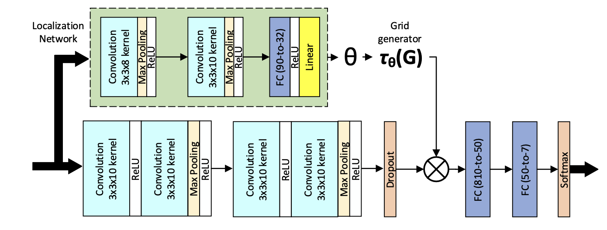

### Implementation of [DeepEmotion](https://www.mdpi.com/1424-8220/21/9/3046) paper

- Network to detect facial emotion expression using CNN and Spatial Transformers.



### Dataset
- Download and prepare [FER 2013 dataset](https://www.kaggle.com/c/challenges-in-representation-learning-facial-expression-recognition-challenge)
  - 48x48 pixel grayscale images of faces
  - emotion shown in the facial expression in to one of seven categories (0 = Angry, 1 = Disgust, 2 = Fear, 3 = Happy, 4 = Sad, 5 = Surprise, 6 = Neutral)
  - The file ```icml_face_data.csv``` contains the train(28709 images), validation(3589 images) and test data(3589 images).
```
  kaggle competitions download -c challenges-in-representation-learning-facial-expression-recognition-challenge
  unzip challenges-in-representation-learning-facial-expression-recognition-challenge.zip
```

### Training
- using torch - 2.1.0
```
  python train.py --log_dir logs -e 100 -b 256
  python test.py --model deep_emotion-256-0.005-300.pt
```
- Test accuracy of 51% after training for 300 epochs. But the paper claims 70.1% accuracy.
- Some information is missing in the paper like the batch size. Going by the Spatial transformer configuration, the input to FC layer would be 1000 instead of 90.

### Live prediction using webcam
- opencv configuration file to be downloaded from [here](https://raw.githubusercontent.com/opencv/opencv/master/data/haarcascades/haarcascade_frontalface_default.xml)
  ```
  python cam.py --model deep_emotion-256-0.005-300.pt
  ```
  
